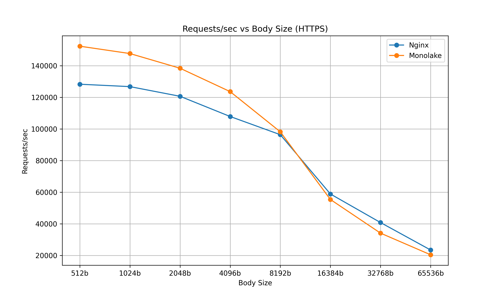
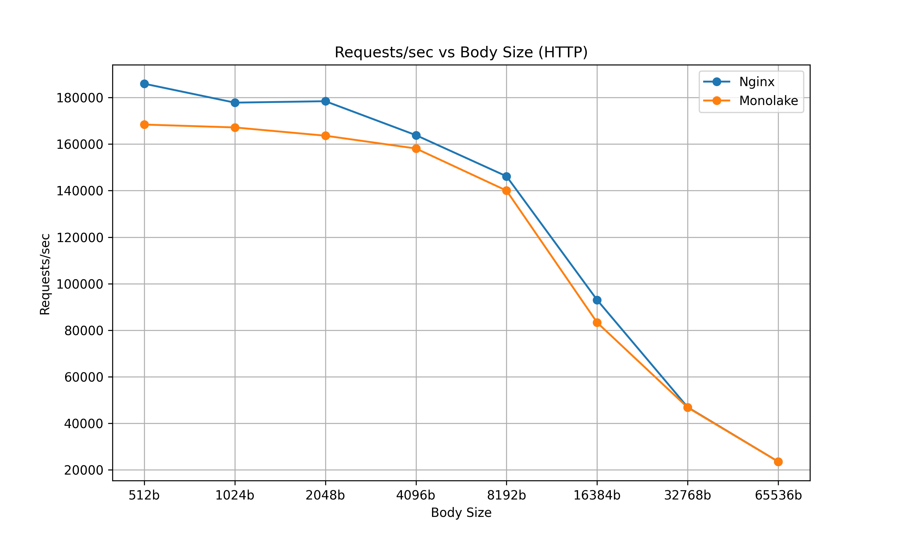
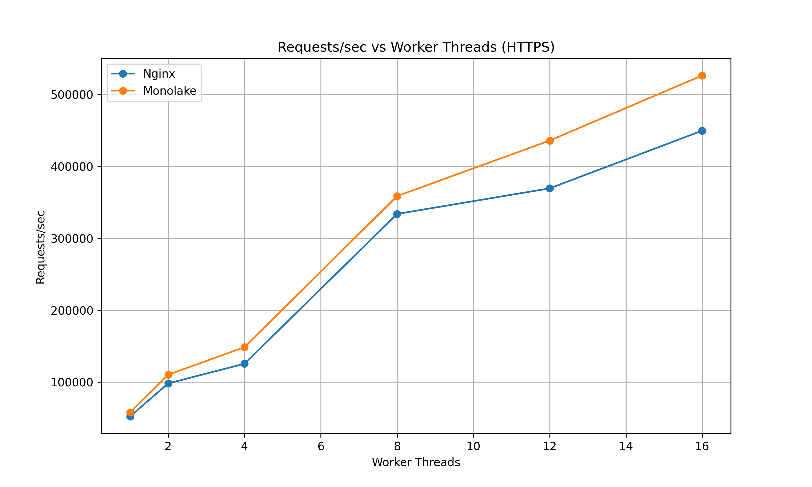
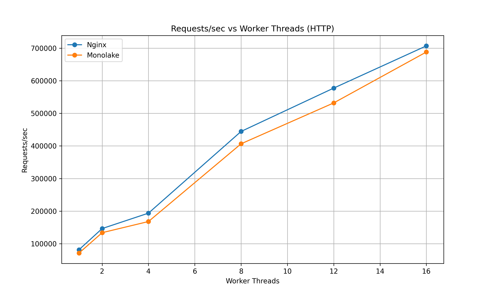

# CloudWeGo-Monolake

简体中文 | [English](README.md)

## Monolake 框架

Monolake 是一个用 **Rust** 开发高性能网络服务（如代理和网关）的框架。其基于原生支持 **io_uring** 的异步运行时[Monoio](https://docs.rs/crate/monoio/latest) 从零设计的。

虽然目前最流行的 Rust 异步运行时是基于 epoll/kqueue 的 [Tokio](https://docs.rs/tokio/latest/tokio/)，但 Monolake 选择了不同的技术路线。由字节跳动开发的 Monoio 运行时采用 **线程-核心（thread-per-core）** 模型，通过 io_uring 的高效异步 I/O 操作充分释放硬件性能。

基于这一创新运行时，Monolake 在生态中全面支持 io_uring 特性，包括专为 io_uring 设计的 IO 抽象和与 Tower 不同的服务架构。同时，Monolake 提供了针对 Thrift 和 HTTP 的 io_uring 优化实现。

Monolake 框架已用于构建多种高性能代理和网关，**并积极部署于 [ByteDance](https://www.bytedance.com/) 下的生产环境**，其典型场景包括：

- **应用网关**：如 HTTP 到 Thrift 的协议转换
- **安全网关**：为 gRPC 和 Thrift RPC 提供数据脱敏能力

## Monolake 代理

[Monolake 代理](https://github.com/cloudwego/monolake/tree/main/monolake) 是基于 Monolake 框架组件构建的高性能 HTTP/Thrift 代理参考实现，展示了框架的核心能力。通过集成 [monoio-transports](https://docs.rs/monoio-transports/latest/monoio_transports/) 的高效网络能力、[service-async](https://docs.rs/service-async/0.2.4/service_async/index.html) 的模块化服务组合机制，以及 [certain-map](https://docs.rs/certain-map/latest/certain_map/) 的类型安全上下文管理，该实现充分体现了 Monolake 的工程实践价值。此外，通过该代理可进行性能基准测试，与 Nginx、Envoy 等主流方案进行对比。

## 核心特性

- **基于 io_uring 的异步运行时（Monoio）**：底层依赖 Monoio 运行时，通过 Linux 内核的 io_uring 特性提供高效的异步 I/O 支持。

- **线程-核心模型**：Monoio 运行时采用线程-核心架构，简化并发编程模型，避免跨线程数据共享的复杂性。

- **增强型服务抽象与生命周期管理**：提供改进的 `Service` 特征，优化借用语义，支持服务版本管理、滚动升级和状态保留等高级生命周期功能。

- **模块化连接器架构**：通过 [monoio-transports](https://crates.io/crates/monoio-transports) 提供可组合的连接器系统，支持通过堆叠 TCP、TLS、HTTP 等组件构建复杂网络方案。

- **类型化上下文管理（certain_map）**：使用 [certain-map](https://crates.io/crates/certain-map) 实现编译期类型安全的上下文管理，简化服务间间接数据依赖。

- **协议优化实现**：提供针对 io_uring 优化的 HTTP/Thrift 协议实现，充分发挥底层运行时性能。

- **模块化扩展设计**：框架设计高度模块化，支持开发者按需定制组件或适配现有实现。

## 性能表现

### 测试环境

- AWS 实例：c6a.8xlarge
- CPU：AMD EPYC 7R13 处理器，16 核 32 线程
- 内存：64GB
- 操作系统：6.1.94-99.176.amzn2023.x86_64（Amazon Linux 2023.5.20240805）
- Nginx 版本：1.24.0

  
  

  
  

## 文档

- [**快速开始**](./docs/getting-started/)
- [**架构设计**](./docs/architecture/)
- [**开发指南**](./docs/tutorial/)
- [**配置指南**](./docs/config-guide/)

## 相关组件

| 组件 | 描述 |
|-------|-------------|
| [monoio-transports](https://crates.io/crates/monoio-transports) | 基础网络组件，提供高性能模块化网络能力（连接器、工具类等） |
| [service-async](https://crates.io/crates/service-async) | 基础服务抽象组件，提供增强型 Service 特征及零成本抽象组合能力 |
| [certain-map](https://crates.io/crates/certain-map) | 类型安全上下文管理，通过编译期检查确保上下文项存在 |
| [monoio-thrift](https://crates.io/crates/monoio-thrift) | 原生支持 io_uring 的 Thrift 实现 |
| [monoio-http](https://crates.io/crates/monoio-http) | 原生支持 io_uring 的 HTTP/1.1 与 HTTP/2 实现 |
| [monoio-nativetls](https://crates.io/crates/monoio-native-tls) | 兼容 monoio 的 native-tls 实现 |
| [monoio-rustls](https://crates.io/crates/monoio-rustls) | 兼容 monoio 的 rustls 实现 |

## 贡献指南

贡献说明详见：[贡献指南](https://github.com/cloudwego/monolake/blob/main/CONTRIBUTING.md)。

## 许可证

Monolake 采用 MIT 或 Apache 许可证。

## 社区

- 邮箱：[conduct@cloudwego.io](mailto:conduct@cloudwego.io)
- 加入社区：[社区成员指南](https://github.com/cloudwego/community/blob/main/COMMUNITY_MEMBERSHIP.md)
- 问题反馈：[议题列表](https://github.com/cloudwego/monolake/issues)
- Discord：加入 [Discord 频道](https://discord.gg/b2WgCBRu) 参与讨论

## 云原生生态

&nbsp;&nbsp;
  
CloudWeGo 项目已加入 <a href="https://landscape.cncf.io/">CNCF 云原生全景图</a>。

