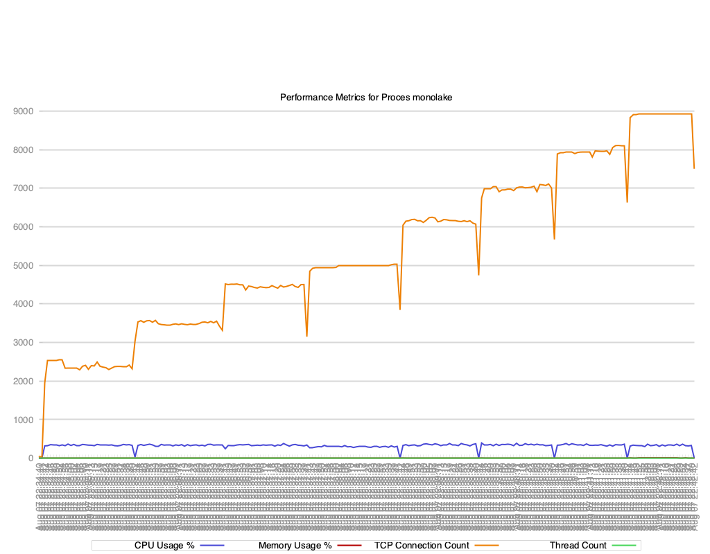
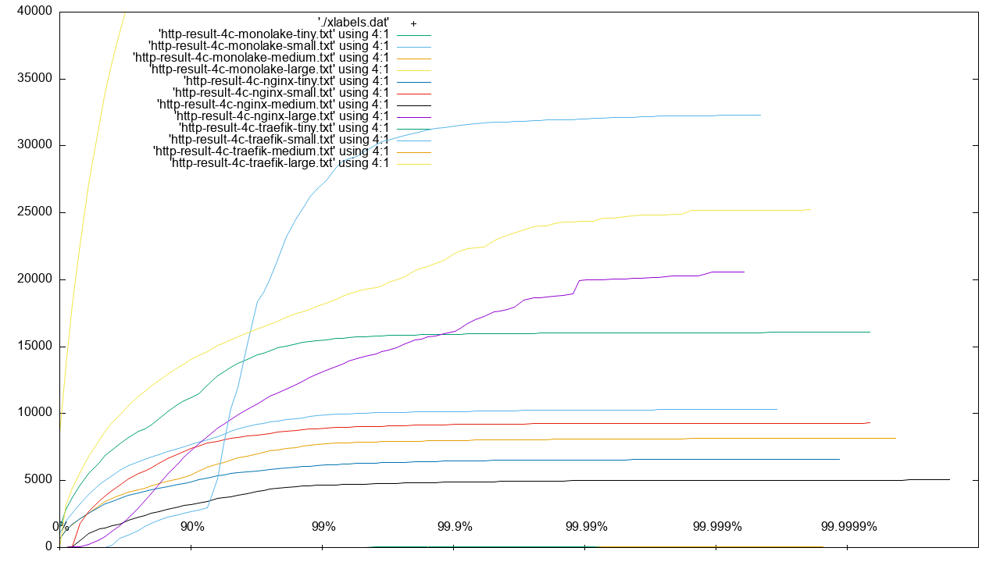
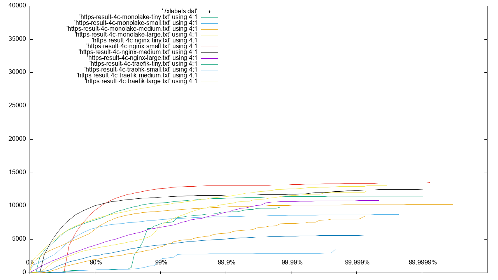
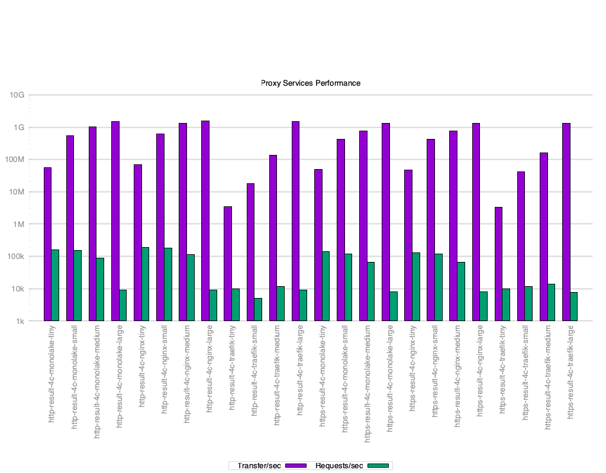
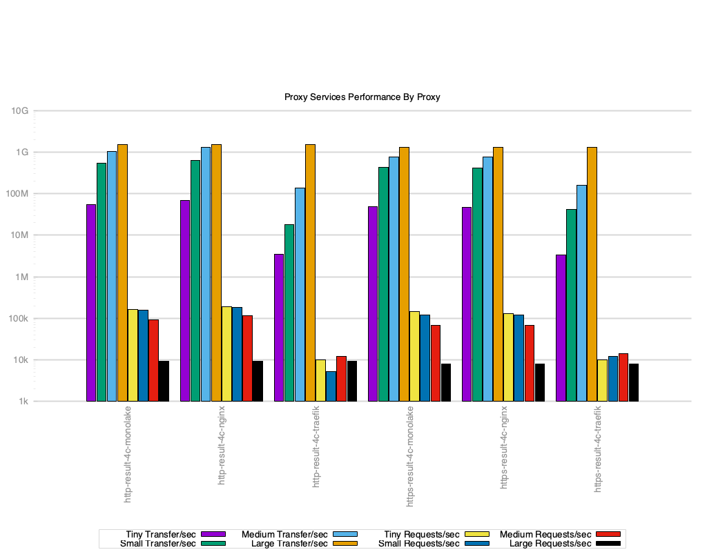

# Monolake Benchmark

Monolake benchmark contains programs and scripts to benchmark monolake's performance and comparison with other popular open source proxy programs.

## Topolonogy

A client and a server will be setup on separated machines and traffic will go through the proxy which will be on another machine. The client machine is more powerful so that when testing it can reach or over the capabilities of the server. All machines are on a stable network environment to flat traffic varies.

Basic test tool is wrk2 and it is installed on client machine. Nginx will be setup on server machine as web backend. Different proxy programs (monolake, nginx, traefik) will be installed and tested to compare.


We plan to benchmark monolake for 2 cases. The first case is monolake on a 4 core machine as proxy, another case is monolake on a 16 core machine.

## Reproduce on AWS EC2 machines

Reference aws ec2 id for client machine: standard aws linux image on c6a.8xlarge

Reference aws ec2 id for server machine: standard aws linux image on c6a.2xlarge

The server machine should be configured with some security group like this:


Reference aws ec2 id for proxy service machine: standard aws linux image on c5a.xlarge (4 cores) and c6a.4xlarge (16 cores)

The proxy machine should be configured with some security group like this:


## Setup

### Client Setup

client/setup-once.sh will be used to install test tools on the client machine: curl, wrk2.

```bash
cd $MONOLAKE_HOME/client
sudo yum -y install gcc git openssl-devel zlib-devel

# download curl: it is installed by default

# download wrk2
cd $HOME
git clone https://github.com/giltene/wrk2
cd wrk2
make WITH_OPENSSL=/usr
```

### Server Setup

server/setup-once.sh will be used to install nginx web server on the server machine.

```bash
sudo yum -y install nginx
sudo mv /etc/nginx/nginx.conf /etc/nginx/nginx-original.conf
sudo cp $MONOLAKE_HOME/benchmark/server/nginx-web.conf /etc/nginx/nginx.conf
sudo openssl req -x509 -nodes -days 365 -newkey rsa:2048 -keyout /etc/nginx/cert.key -out /etc/nginx/cert.pem
sudo cat /etc/nginx/cert.key /etc/nginx/cert.pem > $MONOLAKE_HOME/combined.pem
sudo mv $MONOLAKE_HOME/combined.pem /etc/nginx/
sudo cp -r $MONOLAKE_HOME/benchmark/server/webroot/* /usr/share/nginx/html/
sudo service nginx restart
```

### Proxy Setup

proxy/<>/setup-once.sh will be used to install proxy softwares monolake and comparisons nginx and traefik on the proxy machine.

#### proxy/monolake/setup-once.sh

```bash
sudo yum -y install gcc openssl-devel

# install rust nightly
curl --proto '=https' --tlsv1.2 -sSf https://sh.rustup.rs | sh

cd $MONOLAKE_HOME

# generate certs
sh -c "cd examples && ./gen_cert.sh"
mkdir examples/certs && openssl req -x509 -newkey rsa:2048 -keyout examples/certs/key.pem -out examples/certs/cert.pem -sha256 -days 365 -nodes -subj "/CN=monolake.cloudwego.io"

# build monolake
cd $MONOLAKE_HOME
cargo build
```

#### proxy/nginx/setup-once.sh

```bash
sudo yum install -y nginx
sudo openssl req -x509 -nodes -days 365 -newkey rsa:2048 -keyout /etc/nginx/cert.key -out /etc/nginx/cert.pem
sudo cat /etc/nginx/cert.key /etc/nginx/cert.pem > $MONOLAKE_HOME/combined.pem
sudo mv $MONOLAKE_HOME/combined.pem /etc/nginx/
```

#### proxy/traefik/setup-once.sh

```bash
cd $MONOLAKE_HOME/benchmark/proxy/traefik/
wget https://github.com/traefik/traefik/releases/download/v3.0.0-rc1/traefik_v3.0.0-rc1_linux_amd64.tar.gz
tar zxvf traefik_v3.0.0-rc1_linux_amd64.tar.gz
rm traefik_v3.0.0-rc1_linux_amd64.tar.gz
```

### Configure Server IP

proxy/update-server-ip.sh contain scripts to update server ip in the proxy configure files. But it must be copy&pasted to console with replacing ${MONOLAKE_BENCHMARK_SERVER_IP} with real url, then run manually. Sed does not support environment variables and directly run the script will not result expected replacement.

```bash
cd $MONOLAKE_HOME/benchmark/proxy
sed -i -e 's/127.0.0.1/${MONOLAKE_BENCHMARK_SERVER_IP}/g' nginx/nginx.conf
sed -i -e 's/127.0.0.1/${MONOLAKE_BENCHMARK_SERVER_IP}/g' monolake/monolake.toml
sed -i -e 's/127.0.0.1/${MONOLAKE_BENCHMARK_SERVER_IP}/g' traefik/traefik-dynamic.toml
```

### Runtime Environment Variables

```bash
if [ -z "${MONOLAKE_HOME+set}" ]; then
    export MONOLAKE_HOME=$HOME/monolake
fi

if [ -z "${MONOLAKE_BENCHMARK_PROXY_IP+set}" ]; then
    export MONOLAKE_BENCHMARK_PROXY_IP=localhost
fi

if [ -z "${MONOLAKE_BENCHMARK_SERVER_IP+set}" ]; then
    export MONOLAKE_BENCHMARK_SERVER_IP=localhost
fi
```

## Run Benchmark Test

Normally we run setup-once.sh on each machine first. For proxy machine, we only need run required 1 of 3 proxy services and don't run the other 2. Also we need run update-server-ip.sh.

Now we need make sure the setup is ready. On the client, we set environment variable MONOLAKE_BENCHMARK_SERVER_IP by:

`export MONOLAKE_BENCHMARK_SERVER_IP=<server-ip>`

then run:

```bash
client/verify.sh
```

to make sure the result is expected.

We can run benchmark test for different proxy service. For example, to benchmark monolake proxy service for http:

```bash
client/benchmark-monolake-http.sh
```

Before run the benchmark, make sure MONOLAKE_BENCHMARK_SERVER_IP and MONOLAKE_BENCHMARK_PROXY_IP are set correctly.

## Visualize the result

### Collect the data

#### Collect performance data

Run performance-collect.sh on the machine which need performance data. The script can be run on client, proxy and server. For example

```bash
./performance-collect.sh wrk # client
./performance-collect.sh monolake # proxy
./performance-collect.sh nginx # server
```

#### Collect latency data

When we run benchmark using wrk2, the latency data is already generated and saved to local files.

### Plot the data

gnuplot is used to plot the data and the results are in .png image format. gnuplot needs to be installed. User may also copy the data to another machine with gnuplot installed, and plot the result.

#### Plot performance data

performance-plot.sh will be used to plot the performance data. The results are 4 .png image files: cpu-mem-usage-<process>.png, tcp-count-<process>.png, performance-metrices-<process>.png, thread-count-<process>.png. The script can be run for client, proxy and server. For example

```bash
./performance-plot.sh wrk # client
./performance-plot.sh monolake # proxy
./performance-plot.sh nginx # server
```

#### Plot latency data

There are some scripts to plot latency data in visualization/ directory. For example

```bash
./monolake-http-latency-plot.sh
./monolake-https-latency-plot.sh
./all-http-latency-plot.sh
```

After running the scripts the results are in .png image format.

## Pipeline/Automation

We can simplify the test to pipeline/automation scripts.

Some steps are manual steps.

* Correct URLs/IPs: replace in all benchmark-pipeline-xxx.sh and pipeline-xxx.sh
* Avoid ssh access prompt: ssh to client/proxy service/server once
* Setup: running setup-once.sh in the directories
* Update server-ip in the configuration files: running benchmark/proxy/update-server-ip.sh and follow the sed commands

```bash
export client_url=3.133.229.116
export proxy_url=3.19.41.190
export server_url=3.22.140.218
export proxy_private_url=172.31.7.16
export server_private_url=172.31.22.170
```

Then user can use benchmark-pipeline.sh to run all test in one script. User may need type "exit" to quit some finished jobs and go to the next step. User can early input "exit" when "Writing data to CSV file wrk-performance.csv..." prompts. Finally, user will get the results and visualized images.

Pipeline scripts contain plot scripts, so it is better to run on a host machine with GUI. Following pipeline scripts runs on OS X host and gnuplot is installed on it. If user wants to run pipeline scripts on linux/ubuntu host, please install gnuplot and use gnome-terminal as termainal tool. User may directly use non pipeline scripts on AWS EC2 linux machines.

```bash
# new_terminal=`osascript -e 'tell app "Terminal" to do script $1'`
# new_terminal='gnome-terminal -- $1'

export client_url=3.133.229.116
export proxy_url=3.19.41.190
export server_url=3.22.140.218
export proxy_private_url=172.31.7.16
export server_private_url=172.31.22.170

# manual update proxy configurations
echo "make sure proxy configurations are updated manually"
# ssh -i $HOME/ssh/monolake-benchmark.pem ec2-user@${proxy_url} -t 'cd ~/monolake/benchmark/proxy; MONOLAKE_BENCHMARK_SERVER_IP=${server_url} ./update-server-ip.sh; bash -l'

# start server
echo "start server"
osascript -e 'tell app "Terminal" to do script "~/code/monolake/benchmark/pipeline-server.sh"'
sleep 5

# then start proxy nginx
echo "start proxy nginx"
osascript -e 'tell app "Terminal" to do script "~/code/monolake/benchmark/pipeline-proxy-nginx.sh"'
sleep 5

ssh -i $HOME/ssh/monolake-benchmark.pem ec2-user@${client_url} -t 'rm -f monolake/benchmark/wrk-performance.csv'

# start client nginx
echo "start client nginx"
osascript -e 'tell app "Terminal" to do script "~/code/monolake/benchmark/pipeline-client-nginx.sh"'
sleep 2

echo "start client-metrics-collect"
ssh -i $HOME/ssh/monolake-benchmark.pem ec2-user@${client_url} -t 'cd monolake/benchmark; ~/monolake/benchmark/performance-collect.sh wrk; ~/monolake/benchmark/performance-collect.sh wrk; ~/monolake/benchmark/performance-collect.sh wrk; ~/monolake/benchmark/performance-collect.sh wrk; ~/monolake/benchmark/performance-collect.sh wrk; ~/monolake/benchmark/performance-collect.sh wrk; ~/monolake/benchmark/performance-collect.sh wrk; ~/monolake/benchmark/performance-collect.sh wrk; echo "Please type exit to continue"; bash -l'

#stop proxy nginx
echo "stop proxy nginx"
ssh -i $HOME/ssh/monolake-benchmark.pem ec2-user@${proxy_url} -t 'cd ~/monolake/benchmark/proxy; ./stop-nginx.sh'
sleep 2

# then start proxy traefik
echo "start proxy traefik"
osascript -e 'tell app "Terminal" to do script "~/code/monolake/benchmark/pipeline-proxy-traefik.sh"'
sleep 5

# start client traefik
echo "start client"
osascript -e 'tell app "Terminal" to do script "~/code/monolake/benchmark/pipeline-client-traefik.sh"'
sleep 2

echo "start client-metrics-collect"
ssh -i $HOME/ssh/monolake-benchmark.pem ec2-user@${client_url} -t 'cd monolake/benchmark; ~/monolake/benchmark/performance-collect.sh wrk; ~/monolake/benchmark/performance-collect.sh wrk; ~/monolake/benchmark/performance-collect.sh wrk; ~/monolake/benchmark/performance-collect.sh wrk; ~/monolake/benchmark/performance-collect.sh wrk; ~/monolake/benchmark/performance-collect.sh wrk; ~/monolake/benchmark/performance-collect.sh wrk; ~/monolake/benchmark/performance-collect.sh wrk; echo "Please type exit to continue"; bash -l'

#stop proxy traefik
echo "stop proxy traefik"
ssh -i $HOME/ssh/monolake-benchmark.pem ec2-user@${proxy_url} -t 'cd ~/monolake/benchmark/proxy; ./stop-traefik.sh'
sleep 2

# then start proxy monolake
echo "start proxy monolake"
osascript -e 'tell app "Terminal" to do script "~/code/monolake/benchmark/pipeline-proxy-monolake.sh"'
sleep 5

# start client
echo "start client"
osascript -e 'tell app "Terminal" to do script "~/code/monolake/benchmark/pipeline-client-monolake.sh"'
sleep 2

echo "start client-metrics-collect"
ssh -i $HOME/ssh/monolake-benchmark.pem ec2-user@${client_url} -t 'cd monolake/benchmark; ~/monolake/benchmark/performance-collect.sh wrk; ~/monolake/benchmark/performance-collect.sh wrk; ~/monolake/benchmark/performance-collect.sh wrk; ~/monolake/benchmark/performance-collect.sh wrk; ~/monolake/benchmark/performance-collect.sh wrk; ~/monolake/benchmark/performance-collect.sh wrk; ~/monolake/benchmark/performance-collect.sh wrk; ~/monolake/benchmark/performance-collect.sh wrk; echo "Please type exit to continue"; bash -l'

#stop proxy monolake
echo "stop proxy monolake"
ssh -i $HOME/ssh/monolake-benchmark.pem ec2-user@${proxy_url} -t 'cd ~/monolake/benchmark/proxy; ./stop-monolake.sh'
sleep 2

#stop server
echo "stop server"
ssh -i $HOME/ssh/monolake-benchmark.pem ec2-user@${server_url} -t 'sudo service nginx stop'
sleep 2

echo "visualize"
cd visualization/

# copy collected data from client
echo "copy collected data from client"
scp -i $HOME/ssh/monolake-benchmark.pem ec2-user@${client_url}:wrk-performance.csv .
scp -i $HOME/ssh/monolake-benchmark.pem ec2-user@${client_url}:"wrk2/*.txt" .

#copy collected data from server
echo "copy collected data from server"
scp -i $HOME/ssh/monolake-benchmark.pem ec2-user@${server_url}:nginx-performance.csv ./server-performance.csv

#copy collected data from proxy
echo "copy collected data from proxy"
scp -i $HOME/ssh/monolake-benchmark.pem ec2-user@${proxy_url}:nginx-performance.csv .
scp -i $HOME/ssh/monolake-benchmark.pem ec2-user@${proxy_url}:traefik-performance.csv .
scp -i $HOME/ssh/monolake-benchmark.pem ec2-user@${proxy_url}:monolake-performance.csv .

#plot data
echo "plot data"
./performance-plot.sh nginx
./performance-plot.sh traefik
./performance-plot.sh monolake
./performance-plot.sh server
./performance-plot.sh wrk
./nginx-http-latency-plot.sh
./traefik-http-latency-plot.sh
./monolake-http-latency-plot.sh
./all-http-latency-plot.sh
./nginx-https-latency-plot.sh
./traefik-https-latency-plot.sh
./monolake-https-latency-plot.sh
./all-https-latency-plot.sh
```

The visualized result example:

Proxy service/monolake system performance:



Client/wrk2 http through proxy services latency:



Client/wrk2 https through proxy services latency:



Throughput (in 100K) and requests per second compare:

| Case                            | Requests/sec | Transfer 100K/sec | Server Error | Timeout |
|---------------------------------|--------------|-------------------|--------------|---------|
| http-result-4c-monolake-tiny    |     74601.55 |           2424.00 |         4165 |       0 |
| http-result-4c-monolake-small   |     69203.64 |          22976.00 |         3186 |       0 |
| http-result-4c-monolake-medium  |     65039.26 |          36922.00 |         2906 |       0 |
| http-result-4c-monolake-large   |      7099.66 |         112640.00 |            0 |    1094 |
| http-result-4c-nginx-tiny       |     29030.12 |           1011.00 |            0 |       0 |
| http-result-4c-nginx-small      |     29119.82 |           9742.00 |            0 |       0 |
| http-result-4c-nginx-medium     |     27937.16 |          15935.00 |            0 |       0 |
| http-result-4c-nginx-large      |      6855.93 |         108544.00 |            0 |      13 |
| http-result-4c-traefik-tiny     |      1789.44 |                58 |            0 |       0 |
| http-result-4c-traefik-small    |      1788.20 |            594.00 |            0 |       0 |
| http-result-4c-traefik-medium   |      1787.00 |           1015.00 |            0 |       0 |
| http-result-4c-traefik-large    |      2639.14 |          41810.00 |          773 |   10476 |
| https-result-4c-monolake-tiny   |     60646.01 |           1971.00 |         2729 |      52 |
| https-result-4c-monolake-small  |     55679.08 |          18484.00 |         2910 |      63 |
| https-result-4c-monolake-medium |     52831.08 |          29990.00 |         2496 |      12 |
| https-result-4c-monolake-large  |      5143.48 |          81602.00 |            0 |      12 |
| https-result-4c-nginx-tiny      |     25844.51 |            900.00 |            0 |     243 |
| https-result-4c-nginx-small     |     23697.78 |           7928.00 |            0 |      41 |
| https-result-4c-nginx-medium    |     19677.77 |          11223.00 |          162 |       0 |
| https-result-4c-nginx-large     |      4192.26 |          66454.00 |            0 |     150 |
| https-result-4c-traefik-tiny    |      1479.39 |                48 |          209 |    4224 |
| https-result-4c-traefik-small   |      1692.79 |            562.00 |           25 |    1409 |
| https-result-4c-traefik-medium  |      2428.48 |           1379.00 |           82 |    1007 |
| https-result-4c-traefik-large   |      2892.87 |          45837.00 |           64 |    1891 |




Throughput (in 100K) and requests per second compare by payload size:

| Case                     | Tiny Requests/sec | Small Requests/sec | Medium Requests/sec | Large Requests/sec | Tiny Transfer/sec | Small Transfer/sec | Medium Transfer/sec | Large Transfer/sec | Case                     |
|--------------------------|-------------------|--------------------|---------------------|--------------------|-------------------|--------------------|---------------------|--------------------|--------------------------|
| http-result-4c-monolake  |          74601.55 |           69203.64 |            65039.26 |            7099.66 |           2424.00 |           22976.00 |            36922.00 |          112640.00 | http-result-4c-monolake  |
| http-result-4c-nginx     |          29030.12 |           29119.82 |            27937.16 |            6855.93 |           1011.00 |            9742.00 |            15935.00 |          108544.00 | http-result-4c-nginx     |
| http-result-4c-traefik   |           1789.44 |            1788.20 |             1787.00 |            2639.14 |                58 |             594.00 |             1015.00 |           41810.00 | http-result-4c-traefik   |
| https-result-4c-monolake |          60646.01 |           55679.08 |            52831.08 |            5143.48 |           1971.00 |           18484.00 |            29990.00 |           81602.00 | https-result-4c-monolake |
| https-result-4c-nginx    |          25844.51 |           23697.78 |            19677.77 |            4192.26 |            900.00 |            7928.00 |            11223.00 |           66454.00 | https-result-4c-nginx    |
| https-result-4c-traefik  |           1479.39 |            1692.79 |             2428.48 |            2892.87 |                48 |             562.00 |             1379.00 |           45837.00 | https-result-4c-traefik  |


